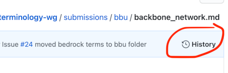
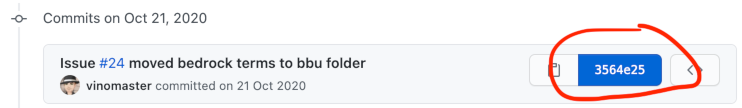
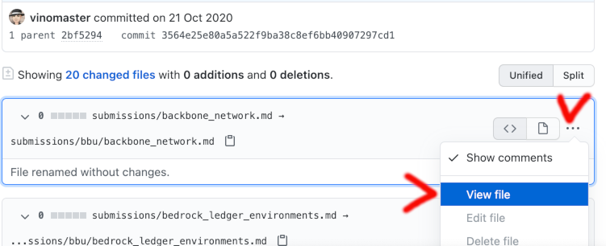

# Hyperlinks

Terminology data needs to be richly linked to maximize its utility. How hyperlinks work is an important subtopic and should be studied carefully.

This document describes hyperlinks as they are used in the [internal data model](internal-data-model.md). This allows those that design, implement and document [tools](../doc/tt-spec.md) to know how to process (CRUD) hyperlinks as their tool ingests, curates or exports data from the corpus.

There is a curate-tool that is capable of transforming links for various purposes.

## Link types

The following categories of hyperlink are managed/curated in the corpus:
* Local links
* Cross-scope links
* Fully qualified links
* Links from issues
* Transverse links

### Local links

A Local link a link between any two pieces of corpus data in the same scope, with no explicit version or branch. This is the most common kind of link in our data, and it is simple to create. A local link is always represented as a relative path from one record to another. Term records are siblings, so `term-a` references `term-b` as `[B](b.md)`. Concepts and terms are in sibling folders, so `term-a` references its parent concept as `[concept 1](../concepts/1.md)`. Individual fields in a record can be referenced by markdown fragment (e.g., to refer to the notes on `term-a`, use `term-a.md#notes`). Note: for info about referring to corpus data from github issues or PR comments, see [links from issues](#links-from-issues).

### Cross-scope links

A cross-scope link is between any two pieces of data that are in the corpus, but NOT in the same scope. They thus have different owners, and are typically used in different contexts. The purpose with cross-scope links is to leverage the shared corpus context, without worrying particularly about versions, branches, and so forth. (Contrast [Transverse Links](#transverse-links) below.) To analyze how cross-scope links work, consider a hypothetical example where `chained VC` (an imaginary term owned by the Authentic Chained Data Containers Task Force) references `witness-registry` (an imaginary term owned by the Utility Foundary Working Group. The [internal data model](internal-data-model.md) allows us to easily predict a relative path from one record to another. This path will always begin with `../..` for any cross-scope link inside the corpus. The record for `chained VC` will be at `corpus/acdctf/terms/chained-vc.md`, and can therefore reference `witness-registry` at `../../ufwg/terms/witness-registry.md`.

### Fully qualified links

These are absolute links -- not dependent on context or location in any way. This is the preferred form of link to use when citing sources, referring to wikipedia articles, or giving credit for images. For example: `https://example.com/foo/bar/baz.html`.

### Links from issues

If you want to refer to a corpus record from a github issue or a PR comment, you can do so with a URL that starts with the prefix `../tree/master/corpus/` and then append the record's path within the corpus: `../tree/master/corpus/efwg/terms/foo.md`. Such links will be clickable, and take you directly to the corpus record in question.

>This works because issues and PRs have URLs like `https://github.com/trustoverip/concepts-and-terminology-wg/issues/123`, and need to reference a URL like `https://github.com/trustoverip/concepts-and-terminology-wg/tree/master/corpus/efwg/terms/foo.md`.

### Transverse links

These are the most precise form of hyperlink. They can reference a specific line of a specific corpus record, on a specific branch, at a specific commit. This might be useful if you need to point to a definition or term as it existed at a particular point in time.

This is the only form of link that's guaranteed to be immutable -- meaning that once you have such a link, the data it retrieves is guaranteed not to change. This is true even if a repo gets completely reorganized, files get renamed or deleted, etc. All other link forms reference a piece of data that can evolve (or disappear) from one fetch to the next.

The downside of transverse links is that they become stale -- not ceasing to work, but ceasing to report the latest information for a given term or concept.

If you are github expert and want to know how to create transverse links, [this doc](https://docs.github.com/en/github/managing-files-in-a-repository/getting-permanent-links-to-files) may be helpful. If you are not a github expert:

1. browse the repo file tree, looking under `/corpus` for the file you want. Once you have the file, look at the file's commit history:

    

2. Then, pick a specific commit from the history:

    

3. This will cause github to display all details for that commit. In those details, find the specific file you want to reference. Click the `...` menu and select `View File`:

    

    At this point, you can copy the URL in your browser's address bar, and it becomes the transverse hyperlink. (If you want to reference a particular line of the file, see [these instructions](https://stackoverflow.com/a/31282559).)

## Links and Tools

Links pose different concerns to different kinds of tools we have for ingestion, curation and export.

### Ingestion tools

[Ingestion tools](../docs/tt-spec.md#ingestion-and-ingestion-tools) are tools that take contents from somewhere, and turn it into files that fit into the [internal data model](internal-data-model.md). 

When designing such tools, care should be taken to properly transform the links from the ingested input to any of the links that are managed/curated in the corpus. It is expected that ingestion tools would mostly want to convert to [local links](#local-links) and [cross-scope links](#cross-scope-links)

### Export tools

[Export tools](../docs/tt-spec.md#export-and-export-tools) are tools that can export a subset of the corpus records, converting their structure and contents such that the result can be used for a specific purpose. Think of exporting corpus records for the creation of a glossary for a scope, or for the creation of a terminology website by using a tool such as MkDocs or Docusaurus.

When designing such tools, care should be taken to properly transform the links from the [internal data model](internal-data-model.md)into the format that is required by the tools that will process its output. Depending on the export data model, this may not be that trivial.
