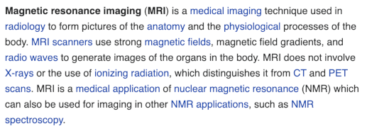

# Term Conventions

Consistency helps us produce higher-quality data. The following conventions are recommended (and, in some cases, enforced by our tools) for that purpose.

### Capital Letters

It is common in legal contracts to capitalize terms that have special meaning within the context of the document. Sometimes this convention is adopted for other types of documents as well.

We do NOT follow this convention as we work with glossary data. That's not because it's a bad convention; it's because it's a *document* convention, and glossary data could be used in lots of different documents (or in artifacts that aren't documents at all).

In our corpus, we only capitalize things if they would be capitalized in the middle of a sentence in a Wikipedia article. In English, this means we capitalize proper nouns (Eiffel Tower) and acronyms (TOIP), and not much else. This paragraph from the Wikipedia article on MRIs, correctly shows lots of terms, but little capitalization:

### Consistent Region

Written languages sometimes have regional differences. For example, British, US, Indian, and Canadian English vary in spelling, vocbulary, and collocations [1](https://www.britishcouncilfoundation.id/en/english/articles/british-and-american-english). Similar things are true of Iberian and American Portuguese and Spanish, of continental versus African French, and so forth.

Within a given glossary, it's good practice to align with one region consistently. Which region you pick is up to you.

### Inflection (Plurals, Verb Tense, etc.)

The default, uninflected version of a term is the one that should be recorded in a glossary.

For nouns, this typically means singular rather than plural: "agent", not "agents". (See the note about nouns derived from verbs, next.)

For verbs, this means the infinitive, unconjugated form that you'd look up in a dictionary. Forms that are derived from a verb in a predictable way (e.g., to create nouns or adjectives) should not appear separately in a glossary, since they are predictable variations that any speaker of the language will understand. For example, an entry for "revoke" belongs in a glossary -- but not "revoking", "revoked", or "revocation".

### Acronyms

Acronyms should be defined in the same glossary entry as their expanded form. They should be written in all caps, without periods between them. This means we would expect a single entry in the glossary to contain both "Trust Over IP" and "TOIP" -- and we would not expect to find "T.O.I.P" or "ToIP" anywhere.

### Apostrophes

Contrary to popular mistakes, plurals are not preceded by an apostrophe in English: "three bikes" -- NOT "three bike's"; "many NFTs (non-fungible tokens) are traded in specialized exchanges" -- NOT "many NFT's..."

In English, nouns are converted into possessive form with an apostrophe: "my bike's tire." However, pronouns (he, she, it, we) are NOT: his, hers, its, ours. (Incorrectly inserting an apostrophe in the possessive form of "it" is perhaps the most common misspelling in the English language.)

### Punctuation and Special Characters

Avoid using smart quotes, emojis, or other characters from the larger Unicode inventory if simple ASCII equivalents would suffice. Stick with whichever quoting convention is consistent with your regional standard (e.g., "..." instead of guillemets «...»).
