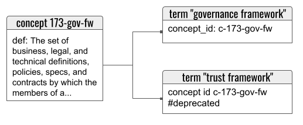

# Term Record

A __term record__ is a markdown-formatted data structure that fully describes one label (possibly with minor variants) for one concept. It is hyperlinked to its associated [concept record](concept-record.md), which contains the the definition of the term.

Splitting the data in this way lets one concept be associated with multiple terms. This is a requirement for localization, but it is also helpful within a single language. It's common for the preferred term for a concept to evolve over time; we've seen this in TOIP contexts as "identity owner" was deprecated in favor of "identity controller," and as "trust framework" became less favored than "governance framework." Such situations give us a relationship like this:



## Naming

A term record lives in a `/terms` folder. It is named according to the convention `<identifier>[-<variant>].md`, where `<identifier>` is a lower-kabob-cased transformation of the term itself, and the optional `-<variant>` is a number appended only when necessary to disambiguate. The filename is chosen by a tool, not humans -- but it is intended to be human-friendly, because it will be used in hyperlinks. The filename should remain stable across evolutions of the content, if at all possible.

Internally, the file is divided into sections using markdown headers. Each section of the file corresponds to a field in the term record.

## Fields

A field is said to "contain" whatever content falls beneath its header.

The only top-level header in the file (preceded by a single `#`) is the term value itself. All other fields are delimited by headers preceded by `##`; additional levels of header represent substucture inside the field in question.

As far as automation is concerned, the order of fields does not matter. However, preference is to organize the file for human readability, with the top-level header containing the term value as the overall title at the top.

### Term Value

This required header acts as a title for the record. It is a single line that contains the canonical representation of the term, obeying [conventions for capitalization, punctuation, and so forth](term-conventions.md). If the term has a short form or acronym, it follows the long form in parentheses, on the same line. Example:

```markdown
# governance framework (GF)
```

Notice how the term is not capitalized, even though it would be customary to use title case in a document title.

Since this field is a markdown header, it cannot contain [hyperlinks](hyperlinks.md).

Synonyms go in separate term records, since they may have different histories, statuses, and supporting data.

### Concept ID

This required field contains a single line of text that is a markdown-formatted [local hyperlink](hyperlinks.md#local-links) to the associated concept record (where the term is defined). The word "concept" followed by the identifier of the concept is the inner text of the link. Example:

```markdown
## Concept ID
[concept 173-gov-fw][../concepts/173-gov-fw.md]
```

See [Concept Identifier in a concept record](concept-record.md#concept-identifer).

### Status

This field is a bulleted list of __status update events__, arranged from newest to oldest. Each event consists of a [status tag](status-tags.md), followed by a space and then a UTC ISO 8601 datetime (granularity can vary) when the status changed. Example:

```markdown
## Status
- #proposed 2021-07-25T18:06
- #approved 2021-09-03T04:17:21.248
```

A record that lacks this field is considered to have the #proposed status with an effective date of the git commit where the file first appeared.

### Examples
This optional field is a bulleted list of __example blocks__. Each block is a quoted paragraph that shows the term being used in context, and that ends with a bracket-enclosed reference (preferably hyperlinked) to the source. Where the term appears in the running text, it should be bolded with `**...**`. Example:

```markdown
## Examples
- "This is a common pattern with HTTP-based cloud agents plus mobile edge agents, which is the most common deployment pattern we expect for many users of self-sovereign identity. Note that the properties of the agency and the routing agent are not particularly special--they are just an external and an internal **mediator**, respectively." [[Aries RFC 0046](https://github.com/hyperledger/aries-rfcs/tree/master/concepts/0046-mediators-and-relays#scenario-7-intra-domain-dispatch)]
- "Use of the forward message in the Routing Protocol requires an exchange of information. The Recipient must know which endpoint and routing key(s) to share, and the Mediator needs to know which keys should be routed via this relationship." [[Aries RFC 0211](https://github.com/hyperledger/aries-rfcs/tree/master/features/0211-route-coordination#motivation)]
```

### Tags
This optional field consists of a bulleted list of [hash tag values](hash-tags.md). The scope of the record can be represented as a hash tag, but does not appear here, since that would be redundant with its encoding in the path of the file in the repo. Status tags appear in the [Status](#status) field, not here. Otherwise, this is the place where the record is marked for searchability in various ways. The field may contain a glossary tag, if the owner of the data is building more than one glossary and wants to use tagging to organize their data. Example:

```markdown
## Tags
- #efwg-geo-eu
- #efwg-geo-us
- #efwg-geo-canada
```

### Notes
This optional field consists of one or more markdown blocks containing arbitrary comments. The markdown blocks may contain arbitrary substructure, as long as a markdown engine would interpret that substructure as belonging "beneath" the Notes header. Example:

```markdown
## Notes
There's been a big debate in the DIF Interop WG about the wisdom of modeling a wallet as a hardware-bound construct. Doing so leads to stronger assumptions about security, but precludes "wallets" that live in the cloud.

We decided to define our term as inclusively as possible.
```
