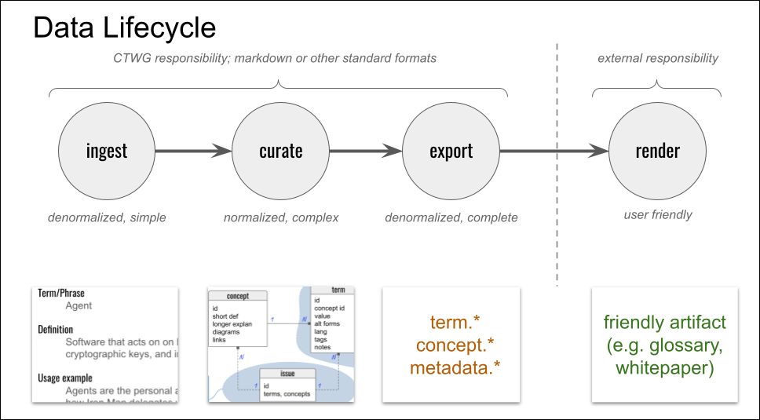

# TOIP-Term

TOIP-Term (TT for short) is a tool that helps the CTWG accomplish its mission to facilitate crisp mental models and consistent, carefully defined language in all the work activities of the foundation.

This document is a specification that describes the vision and requirements of TT.

### Scope

TT is a specialized tool for managing terminology. It does NOT replace the standard tools that directly generate our [TOIP deliverables](https://github.com/trustoverip/deliverables/). We already have tools that do that:

* Github is our tool for managing content, versioning, and ticketing.
* Members of the TOIP community use their favorite markdown editors to modify basic data.
* SpecUp is our tool for publishing specifications from markdown.
* MkDocs is our tool for publishing websites and similar documentation from markdown.

None of these tools manage terminology. TT plugs that gap (and _only_ that gap). *It is important to understand that TT itself does not publish glossaries*; rather, it publishes data that a markdown transformation tool can use as input (e.g., MkDocs to convert the data into a browsable glossary, or SpecUp to convert the data into hyperlinks in a spec). TT provides hooks that can invoke these other tools, but technically, TT's scope ends with raw data in the [exported data model](../docs/exported-data-model.md).

### People

__Direct users__ of TT are imagined to be CTWG members. They have learned some terminology theory and TT's internal data model. A few interested community members might also use TT directly, if they are spending a lot of time doing [curation](../docs/curation.md), or if they are active maintainers of TOIP repos. Direct users invoke TT from the command-line, and must be comfortable with git.

__Indirect users__ of TT are members of the TOIP community who want to use terms and glossaries carefully, but who have little interest in the underlying tooling. Indirect users trigger TT's behavior through [github issues](../../issues/choose) and PRs; automation and/or human maintainers then run the TT tool in the background.

Both direct and indirect users benefit from glossaries and other TOIP deliverables that are generated from data emitted by TT.

### The Corpus

TT manages a collection of markdown files in a github repo. This collection is known as the __corpus__. Conceptually, this corpus plays the same role as a database &mdash; it is the single source of truth for all terminology under TT's management. We store the corpus in github, rather than a standard DB, because:

* We want to be able to work with the corpus offline or locally.
* Many sophisticated DB features (ACID transactions, fancy queries, permissions, replication, concurrent editing...) are unnecessary.
* We want strong github integration: ticketing, the PR process, versioning, branching.
* Using github maximizes our alignment with the rest of TOIP.
* Github allows TT to be used by other open source communities with minimum friction.

This corpus is organized into an [internal data model](../docs/internal-data-model.md).

### Lifecycle

Ceoncept and terminology data goes through the following lifecyle:



Ingestion is managed through github issues (see * [Add a new term to an existing glossary](../../issues/new?assignees=&labels=term&template=01-new-term.md&title=%5BTERM%5D+%3Cword+or+phrase+you+are+adding%3E) and [Import a batch of data](../../issues/new?assignees=&labels=import&template=03-new-import.md&title=%5BIMPORT%5D+%3Cdescription+of+data+source%3E)) and PRs. Ingestable data conforms to what we call the [ingestable data model](../docs/ingestable-data-model.md). This is a simple format that's deliberately intuitive for non-experts. TT provides some features that allow processing ingested data for QA and normalization purposes.

### Command Line

The TT program can be invoked from any clone of its repo. It lives under /bin/tt (a bash script with executable permissions on posix) and /bin/tt.bat (on windows); both of these are simple wrappers that turn around and invoke /bin/tt.py with the python3 runtime. The syntax of the command line is:

```
tt <operation> <params>

tt ingest <path> <scope> -- Read data from the file or folder at <path>.
          Confirm that the data matches the ingestable data model. If yes,
          use the data to populate new term and concept records in the the
          portion of the corpus owned by <scope>.
tt check <record glob> -- Read the corpus and check for well formedness in
          all files that match the specified globbing pattern. Update the 
          #checked status of any records that change status. Report errors.
tt checklink <record glob> -- Validate hyperlinks in all files that match the
          specified globbing pattern. Report errors.
tt tag <record glob> <plus or minus> <tag> -- Add or remove a tag from all
          files that match the specified globbing pattern.          
tt export <export def> <path> -- Using the specified export definition, select
          a subset of the data from the associated scope, and convert it from
          the internal data model to the exported data model. Write the
          results to the new folder identified by <path>.
```